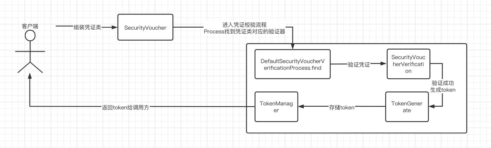

# 安全组件---服务端

## 一、包说明
```
authentication: 授权相关组件封装
controller: 对外开放接口
service: 核心服务（token颁发 和 销毁）
token: token管理、token生成
voucher: 凭证类封装

SecurityServerAutoConfiguration 自动装配
```

## 二、流程说明

1. 调用方凭证类封装
2. 授权服务通过SecurityServer中提供的authorize()方法进行认证
    2.1 authorize()中调用SecurityVoucherVerificationProcess接口中提供的认证过程处理方法认证凭证并返回token
    2.2 将认证返回的token管理到TokenManager并与用户权限信息关联
3. 销毁token通过SecurityServer中提供的tokenDestroy()方法销毁token


## 三、提供接口
```
// 校验url权限的服务url
private String serverUrlOfCheckUrl = "/security/check_url";

// 校验permsCode权限的服务url
private String serverUrlOfCheckPermsCode = "/security/check_perms_code";

// 校验permsCode权限的服务url
private String serverUrlOfCheckStaticResPath = "/security/check_static_res_path";

// 校验permsCode权限的服务url
private String serverUrlOfTokenToAuthority = "/security/token_to_authority";
```
以上接口可以通过http直接调用

## 四、自定义认证方式
 
server中提供了默认的登录凭证 和 凭证类认证器
```
@Getter
@Setter
@AllArgsConstructor
@NoArgsConstructor
@ApiModel(value = "用户名密码凭证类")
public class DefaultUsernamePasswordVoucher implements SecurityVoucher {

    @ApiModelProperty(value = "用户名")
    private String username;

    @ApiModelProperty(value = "密码")
    private String password;

}

/**
 * 默认用户校验适配器
 *
 * @author lh0811
 * @date 2021/5/8
 */
public class DefaultUsernamePasswordVoucherVoucherVerification implements SecurityVoucherVerification<DefaultUsernamePasswordVoucher> {
    @Override
    public SecurityAuthority verification(DefaultUsernamePasswordVoucher defaultUsernamePasswordVoucher) throws Exception {
        if (defaultUsernamePasswordVoucher.getUsername().equals("admin") && defaultUsernamePasswordVoucher.getPassword().equals("123456")) {
            SecurityAuthority securityAuthority = new SecurityAuthority();
            securityAuthority.setSecurityUser(new SecurityUser("1", "admin"));
            securityAuthority.setSecurityRoleList(Lists.newArrayList(new SecurityRole("管理员")));
            securityAuthority.setSecurityResList(Lists.newArrayList(SecurityRes.allCodeRes(), SecurityRes.allUrlRes()));
            return securityAuthority;
        }
        throw CommonException.create(ServerResponse.createByError("用户名或密码错误，默认admin-123456"));
    }
}
```

如果想要自定义凭证类
只需要增加一个SecurityVoucher 的 实现类 自定义凭证字段
增加一个SecurityVoucherVerification<T>实现类 将泛型指定为其对应的凭证类。并完成认证。返回用户的权限信息即可。
